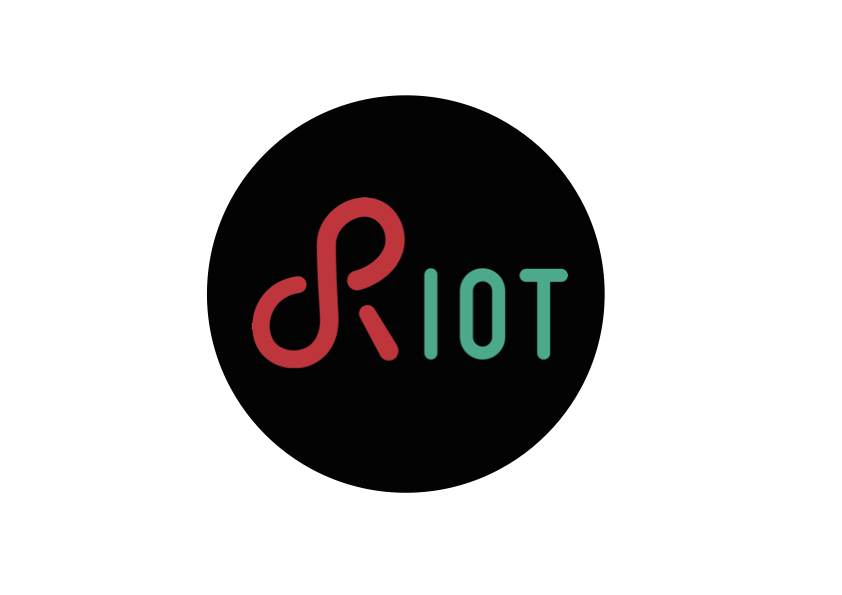

- RDM: 0
- Title: RIOT Developer Memo Format, Publishing and Maintenance Process
- Author: Emmanuel Baccelli
- Status: Active
- Type: Process
- Created: October 2018

## Abstract

This memo describes a template for memos produced by the RIOT maintainers
community, targeting primarily RIOT developers.

## Status

This document is a product of the community of RIOT maintainers, and aims to
represent the consensus within this community. The content of this document is
licensed with a Creative Commons CC-BY-SA license.

## Terminology

This memo uses the [RFC2119](https://www.ietf.org/rfc/rfc2119.txt) terminology
and the following acronyms:

- RDM: RIOT Developer Memo
- PR: git Pull-Request to RIOT's master branch on GitHub
- ACK: acknowledgement from a RIOT maintainer, concerning a pull-request to the
master branch of RIOT on GitHub

# 1. Introduction

In order to facilitate RIOT maintenance in the long term and at large scale,
additional documentation complementing code and usual code documentation is
needed. For instance, such memos are expected to describe and give explanations
about architectural design decisions, code structure etc. Other memos might
also describe other aspects of RIOT activity, including, but not limited to,
RIOT community processes, position with respect to some related external
technical debates, pitfalls and best practices...

This memo specifies a format for such memos and the process of discussing their
content before publication. Format and processes are somewhat inspired by
[IETF](http://ietf.org/) processes and documents such as Request For Comments
(RFC) and Python Enhancement Proposals [PEPs](https://www.python.org/dev/peps/). 

# 2. RIOT Developers Memo Format

RIOT Developer Memos (RDM) are written in English, using the Markdown (.md)
format, with less than 80 characters per line. Each memo has a unique
identification number indicated in its header,
e.g. this memo is RDM0.

The structure of a memo MUST contain:

1. a preamble as defined below,
2. the content of the memo structured as needed,
3. a postamble as defined below.

The preamble of the memo should be structured as such:

1. a header formatted as the header of this memo,
2. a short abstract,
3. a status for the memo stating its license and the category of the memo (e.g.
that it is a consensus document),
4. optionally, a terminology section which recalls/disambiguates definition of
terms that are key to the memo.

The core content of the memo is structured as deemed necessary. However, during
the review process, care must be taken to follow the below principles as much
as possible:

1. one memo = one problem/aspect,
2. start by crisply explaining and motivating the one problem/aspect the memo
targets,
3. memos are expected to be of normative and durable nature, hence: keep a memo
as concise as possible without impairing clarity, and factor out content that
id likely to quickly become out-of-date.

The postamble of the memo should be structured as such:

1. (optional) acknowledgements section thanking contributors other than the
authors,
2. a section with the main references that relate to the content, with a strong
preference for permanent, self-contained references,
3. the list of revisions so far and corresponding changelog,
4. contact information to reach the author(s).

# 3. Memo Publishing and Maintenance Process

Each new memo MUST be proposed as a pull-request (PR),
and discussed the same way RIOT code PRs are processed on GitHub.

Initially, a proposed RDM is identified by its temporary file name
of shape rdm-draft-<author>-<topic>.md (for
example: rdm-draft-baccelli-rdm-format.md) instead of a number
assigned at a later stage.
At this stage, the RDM's header indactes status "draft".

Proposing an RDM is non-compulsory. There is no restriction on when, in the
development cycle, an RDM can be PRed. However, RDMs on design decisions and
architecture are typically expected to describe something rather stable (that is
already merged in the main branch of RIOT, or about to be merged).

Once proposed, a memo MUST have received an ACK by at least 3 maintainers other
than the author(s) of the memo, before its publication.

At this stage, the RDM is assigned a permanent RDM number (the next available),
its status is changed to "active" and it is merged in the master branch of RIOT.
Once merged into the master branch of RIOT, a memo is considered published.

Small changes/clarifications may be subsequently PRed to improve a memo, using
the same RDM number. In this case, a (monotonically increasing) revision number
is issued and a changelog is added -- see Revision section in postamble below.

Bigger changes should result in a new memo with another
RDM number, deprecating the old memo. In this case, the deprecated memo must
be modified such that its status indicates "deprecated by [RDM XXXX](./rdmXXXX.md)"
where X is the RDM number of the new memo.

A dedicated directory in RIOT codebase (RIOT/doc/memos) contains all the memos.
It is acceptable to add complementary content such as graphical elments
(in RIOT/doc/memos/files/) to illustrate the memo, as done with the RIOT logo
below (see Figure 1, given here for pure sake of example).
However graphical content should be kept to the bare
minimum, as it is easy to get lost in "shiny slideware".

Figure 1. The RIOT logo.

## Acknowledgements

Thanks to Thomas Eichinger, Oliver Hahm, Ludwig Knüpfer, Martine Lenders,
Sebastian Meiling, Hauke Petersen, Dan Petry, Kaspar Schleiser and
Matthias Wählisch for their comments and suggestions.

## References

- Internet Engineering Task Force ([IETF](http://ietf.org/))
- Guide to [Contributing to RIOT](https://github.com/RIOT-OS/RIOT/wiki/Contributing-to-RIOT)

## Revision

- Rev2: added title in metadata and specification of temporary RDM naming
- Rev1: added text on non-compulsory nature of RDMs
- Rev0: initial document

## Contact

The author of this memo can be contacted via email at emmanuel.baccelli@inria.fr

